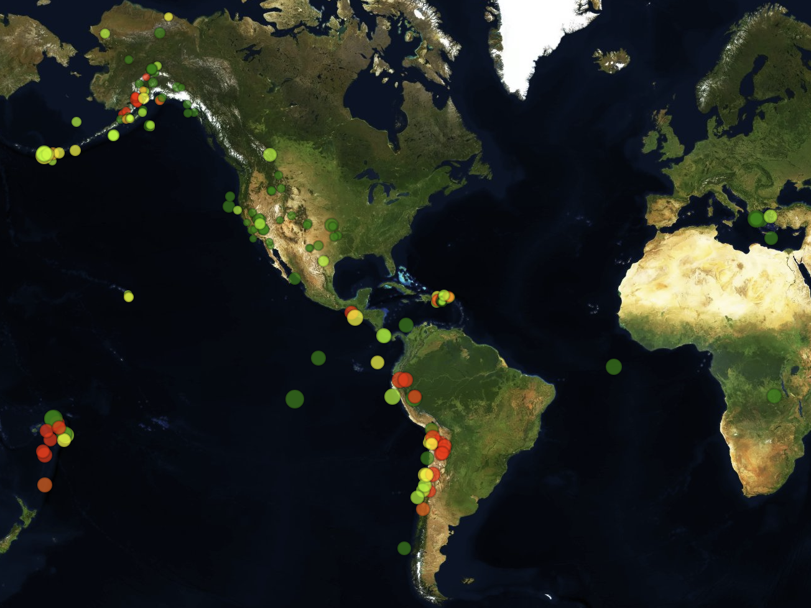
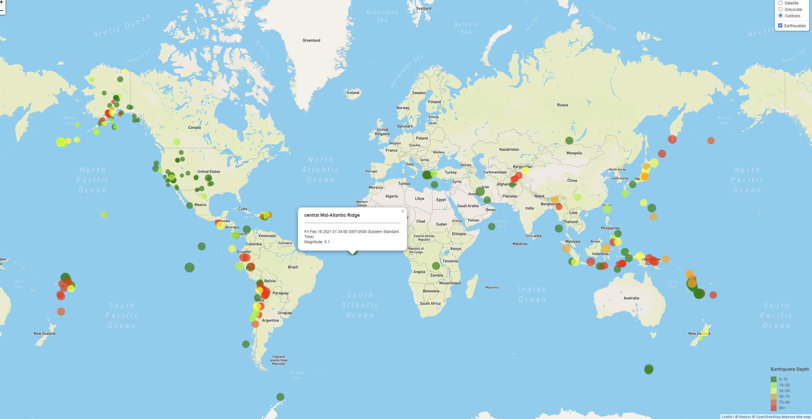

# Earthquake GeoJSON Mapping

This project displays earthquakes recorded by the USGS over the past week with magnitude 2.5 and over on an interactive map. The points are gathered from a dynamic GeoJSON file.


### Technology Used

- Mapbox
- Leaflet.js
- Javascript
- HTML5 
- CSS


### Creating the map using JavaScript

Perform a get request on the url
```javascript
d3.json(queryUrl, function(data) {
    createFeatures(data);
});
```


Create Map features
``` javascript
    function onEachFeature(feature, layer) {
        layer.bindPopup("<h3>" + feature.properties.place + "</h3><hr><p>" +
            new Date(feature.properties.time) +
            "<br>Magnitude: " + feature.properties.mag + "</p>");
    };
```


Create map views - This is done for each view 
```javascript
    var satellite_map = L.tileLayer("https://api.mapbox.com/styles/v1/{id}/tiles/{z}/{x}/{y}?access_token={accessToken}", {
        attribution: "© <a href='https://www.mapbox.com/about/maps/'>Mapbox</a> © <a href='http://www.openstreetmap.org/copyright'>OpenStreetMap</a> <strong><a href='https://www.mapbox.com/map-feedback/' target='_blank'>Improve this map</a></strong>",
        tileSize: 512,
        maxZoom: 18,
        zoomOffset: -1,
        id: "mapbox/satellite-v9",
        accessToken: API_KEY
    });
```


Create the map!
```javascript
   var myMap = L.map("plot-area", {
        center: [5.3, 141.2],
        zoom: 4,
        layers: [outdoor_map, earthquakes]
    });
```


### Screenshots

Satellite View



Example Tool Tip



### GeoJSON Source

[USGS Earthquake Hazards Program](https://earthquake.usgs.gov/earthquakes/feed/v1.0/geojson.php)


---
Nikita Case 
